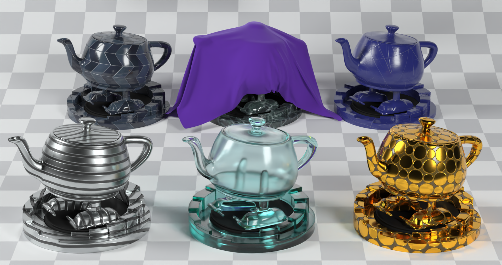

GLSL-PathTracer
==========
A physically based path tracer that runs in a GLSL fragment shader.

Features
--------
- Unidirectional path tracer
- RadeonRays for building BVHs (Traversal is performed in a shader)
- Disney BSDF
- OpenImageDenoise
- Texture Mapping (Albedo, Metallic-Roughness, Normal)
- Analytic Lights (Sphere, Rect, Directional) with MIS
- IBL
- Progressive + Tiled Rendering
- Load Scene from ui
- Load Environment Map from ui in hdr, exr formats
- Save image to png, tga, bmp, jpg, exr, hdr from ui
- Render fixed samples or fixed time and save image
- Control many paremeters of camera from keyboard
- Save image with samples interval or time interval periodically
- Parallel and optimised textures load
- Rotate environment map by X and Y
- Print current camera params
- Show samples and render time in window title
- Adaptive antialiasing (-aaa nsamples - adaptive antialiasing pass every nsamples)

Build Instructions
--------
Please see INSTALL-WIN.txt for the build instructions for Windows and INSTALL-LINUX.txt for Linux

Sample Scenes
--------
A couple of sample scenes are provided in the repository. Additional scenes can be downloaded from here:
https://drive.google.com/file/d/1UFMMoVb5uB7WIvCeHOfQ2dCQSxNMXluB/view

Gallery
--------

--------

--------

--------

--------

--------

--------

--------

--------

--------

--------

Controls
--------
| Key                     | Action                                                                                |
|-------------------------|---------------------------------------------------------------------------------------|
| **W / A / S / D**       | Move camera step forward, left, back, right                                           |
| **R / F**               | Move camera up/down 																  |
| **Mouse left**          | Look around                                                                           |
| **Mouse right**         | Camera forward/back                                                                   |
| **Mouse middle**        | Camera pan                                                                            |
| **Home / End**          | Adjust movement speed                                                                 |
| **Z / X**               | Adjust environment map emission                                                       |
| **N / M**               | Rotate environment map by X                                                           |
| **Y / H**               | Rotate environment map by Y                                                           |
| **I / K / J / L**       | Rotate camera by X, Y                                                                 |
| **Arrow keys**          | Move camera                                                                           |
| **Page Up / Down**      | Move camera up/down                                                                   |
| **, / .**               | Change FOV                                                                            |
| **P**                   | Print current camera params                                                           |
| **Tab**                 | Toggle UI visibility                                                                  |

Use Ctrl-Shift for 100x step, Ctrl for 1/10 step, Alt for 1/2 step, Shift for 10x step

References/Credits
--------
- A huge shout-out to Cedric Guillemet (https://github.com/CedricGuillemet) for cleaning up the code, adding the UI, integrating ImGuizmo, cmake and quite a lot of fixes.
- Tinsel Renderer (https://github.com/mmacklin/tinsel) A really amazing renderer which has several features. A modified version of the scene description & loader are taken from here. Reference for MIS, light sampling
- Ray Tracing in One Weekend (https://github.com/petershirley/raytracinginoneweekend) Peter Shirley's excellent book introductory book on raytracing which helped me get started on this project
- Mitsuba Renderer (https://github.com/mitsuba-renderer/mitsuba) Reference for validation of the code.
- Erich Loftis's THREE.js PathTracer (https://github.com/erichlof/THREE.js-PathTracing-Renderer) Several amazing webgl examples including bidirectional path tracing; all running in a web browser.
- OptiX Introduction Samples (https://github.com/nvpro-samples/optix_advanced_samples/tree/master/src/optixIntroduction)
